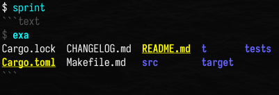

# About

The `sprint` crate provides the [`Shell`] struct which represents a shell
session in your library or CLI code and can be used for running commands:

* [Show the output](#run-commands-and-show-the-output)
* [Return the output](#run-commands-and-return-the-output)

[`Shell`] exposes its properties so you can easily
[create a custom shell](#customize) or [modify an existing shell](#modify) with
the settings you want.

[`Shell`]: https://docs.rs/sprint/latest/sprint/struct.Shell.html

---

The `sprint` crate also provides the `sprint` CLI which provides an easy way to
use the library directly from the command line in two modes:

* [Run command(s) given as arguments](#run-commands-given-as-arguments)
* [Run interactively](#run-interactively)

# CLI examples

```text
$ sprint -h
Command runner

Usage: sprint [OPTIONS] [STRING]...

Arguments:
  [STRING]...  File(s) or command(s)

Options:
  -s <STRING>          Shell [default: "sh -c"]
  -f <STRING>          Fence [default: ```]
  -i <STRING>          Info [default: text]
  -p <STRING>          Prompt [default: "$ "]
      --color <COLOR>  Force enable/disable terminal colors [default: auto]
                       [possible values: auto, always, never]
  -h, --help           Print help
  -V, --version        Print version
```

## Run command(s) given as arguments

~~~text
$ sprint ls
```text
$ ls
Cargo.lock
Cargo.toml
CHANGELOG.md
Makefile.md
README.md
src
t
target
tests
```

~~~

## Run interactively



# Library examples

## Run command(s) and show the output

~~~rust
use sprint::*;

let shell = Shell::default();

shell.run(&[Command::new("ls"), Command::new("ls -l")]);

// or equivalently:
//shell.run_str(&["ls", "ls -l"]);
~~~

## Run command(s) and return the output

~~~rust
use sprint::*;

let shell = Shell::default();

let results = shell.run(&[Command {
    command: String::from("ls"),
    stdout: Pipe::string(),
    codes: vec![0],
    ..Default::default()
}]);

assert_eq!(
    results[0].stdout,
    Pipe::String(Some(String::from("\
Cargo.lock
Cargo.toml
CHANGELOG.md
Makefile.md
README.md
src
t
target
tests
\
    "))),
);
~~~

## Customize

~~~rust
use sprint::*;

let shell = Shell {
    shell: Some(String::from("sh -c")),

    dry_run: false,
    sync: true,
    print: true,

    fence: String::from("```"),
    info: String::from("text"),
    prompt: String::from("$ "),

    fence_color: bunt::style!("#555555"),
    info_color: bunt::style!("#555555"),
    prompt_color: bunt::style!("#555555"),
    command_color: bunt::style!("#00ffff+bold"),
    error_color: bunt::style!("#ff0000+bold+italic"),
};

shell.run(&[Command::new("ls"), Command::new("ls -l")]);
~~~

## Modify

~~~rust
use sprint::*;

let mut shell = Shell::default();

shell.shell = None;

shell.run(&[Command::new("ls"), Command::new("ls -l")]);

shell.sync = false;

shell.run(&[Command::new("ls"), Command::new("ls -l")]);
~~~

# Changelog

* 0.1.0 (2023-12-22): Initial release
    * 0.1.1 (2023-12-24): Fix readme
    * 0.1.2 (2023-12-24): Fix readme
* 0.2.0 (2023-12-26): Redesign; update dependencies
* 0.3.0 (2023-12-27): Add error handling
* 0.4.0 (2023-12-29): Fix error handling
* 0.5.0 (2024-01-05): Add CLI; update dependencies
* 0.6.0 (2024-01-05): Fix script mode output
    * 0.6.1 (2024-07-26): Fix makefile; update dependencies
* 0.7.0 (2024-08-04): Switch terminal colors from [`bunt`] to [`owo-colors`] ([ref][rain-rust-cli-colors]); add `--color` option; update dependencies

[`bunt`]: https://crates.io/crates/bunt
[`owo-colors`]: https://crates.io/crates/owo-colors
[rain-rust-cli-colors]: https://rust-cli-recommendations.sunshowers.io/managing-colors-in-rust.html

