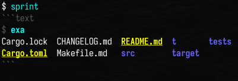

# About

The `sprint` crate provides the [`Shell`] struct which represents a shell
session in your library or CLI code and can be used for running commands:

* [Show the output](#run-commands-and-show-the-output)
* [Return the output](#run-commands-and-return-the-output)

[`Shell`] exposes its properties so you can easily
[create a custom shell](#customize) or [modify an existing shell](#modify) with
the settings you want.

[`Shell`]: https://docs.rs/sprint/latest/sprint/struct.Shell.html

---

The `sprint` crate also provides the `sprint` CLI which provides an easy way to
use the library directly from the command line in three modes:

* [Run command(s) given as arguments](#run-commands-given-as-arguments)
* [Run interactively](#run-interactively)
* [Run in watch mode](#run-in-watch-mode)

# CLI examples

```text
$ sprint -h
!run:../target/release/sprint -h
```

## Run command(s) given as arguments

~~~text
$ sprint ls
!run:cd .. && ./target/release/sprint --color=never ls
~~~

## Run interactively



## Run in watch mode

Run a command, watch one or more file or directory paths for changes, kill the command if it is
still running, and rerun the command.

Watch mode is similar to [`cargo-watch`], [`watchexec`], [`inotifywait`], and other utilities except
these *misfire* on events that don't actually modify a file's *contents*; `sprint` only runs if a
watched file's contents are modified, or a file or directory is created or deleted in a watched
directory.

If a command is not provided, `sprint` simply reports actionable changes.
A `.gitignore` file in the current directory is used to ignore files unless given explicitly by a
`-w` option.
Use the `-d` option to modify the debounce time used to ignore subsequent events.

[`cargo-watch`]: https://crates.io/crates/cargo-watch
[`watchexec`]: https://crates.io/crates/watchexec-cli
[`inotifywait`]: https://linux.die.net/man/1/inotifywait

~~~text
$ sprint -w src 'cargo build'
```text
$ cargo build
    Finished `dev` profile [unoptimized + debuginfo] target(s) in 0.05s
```

* Modified: `src/bin/sprint.rs`

```text
$ cargo build
   Compiling sprint v0.9.0 (/home/qtfkwk/github.com/qtfkwk/sprint)
    Finished `dev` profile [unoptimized + debuginfo] target(s) in 0.96s
...
~~~

# Library examples

## Run command(s) and show the output

~~~rust
use sprint::*;

let shell = Shell::default();

shell.run(&[Command::new("ls"), Command::new("ls -l")]);

// or equivalently:
//shell.run_str(&["ls", "ls -l"]);
~~~

## Run command(s) and return the output

~~~rust
use sprint::*;

let shell = Shell::default();

let results = shell.run(&[Command {
    command: String::from("ls"),
    stdout: Pipe::string(),
    codes: vec![0],
    ..Default::default()
}]);

assert_eq!(
    results[0].stdout,
    Pipe::String(Some(String::from("\\
Cargo.lock
Cargo.toml
CHANGELOG.md
Makefile.md
README.md
src
t
target
tests
\\
    "))),
);
~~~

## Customize

~~~rust
use sprint::*;

let shell = Shell {
    shell: Some(String::from("sh -c")),

    dry_run: false,
    sync: true,
    print: true,

    fence: String::from("```"),
    info: String::from("text"),
    prompt: String::from("$ "),

    fence_color: bunt::style!("#555555"),
    info_color: bunt::style!("#555555"),
    prompt_color: bunt::style!("#555555"),
    command_color: bunt::style!("#00ffff+bold"),
    error_color: bunt::style!("#ff0000+bold+italic"),
};

shell.run(&[Command::new("ls"), Command::new("ls -l")]);
~~~

## Modify

~~~rust
use sprint::*;

let mut shell = Shell::default();

shell.shell = None;

shell.run(&[Command::new("ls"), Command::new("ls -l")]);

shell.sync = false;

shell.run(&[Command::new("ls"), Command::new("ls -l")]);
~~~

# Changelog

Please find the [`CHANGELOG.md`] in the [repository].

[`CHANGELOG.md`]: https://github.com/qtfkwk/sprint/blob/main/CHANGELOG.md
[repository]: https://github.com/qtfkwk/sprint/

